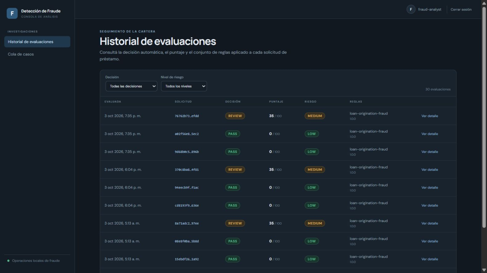
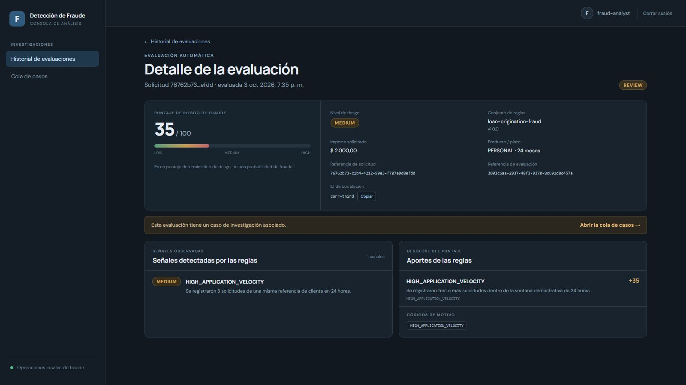
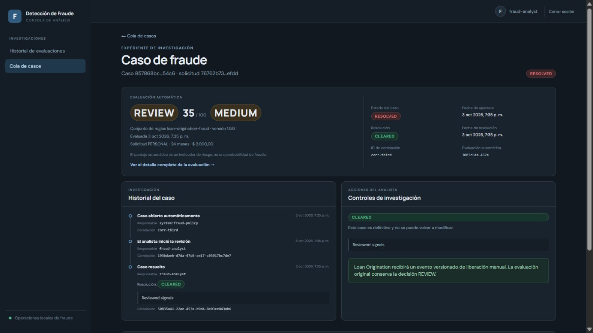
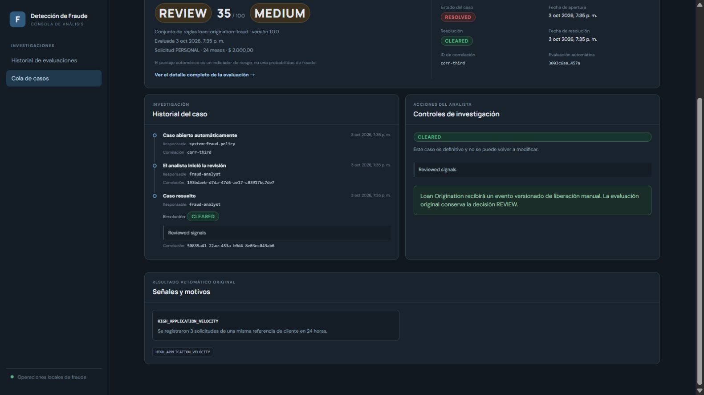
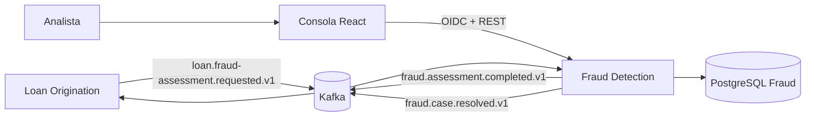

# Fraud Detection Engine

Servicio independiente que detecta señales potencialmente sospechosas en solicitudes de préstamo y permite investigarlas. No calcula capacidad crediticia ni cambia directamente solicitudes o préstamos.

## Recorrido visual y lectura técnica

**Java 25 · Quarkus 3.39.5 · PostgreSQL · Flyway · Kafka/outbox · OIDC/Keycloak · React · TypeScript**



Este motor separa detección automática e investigación humana. Una regla puede producir REVIEW y abrir un caso; resolverlo como CLEARED conserva el assessment original y emite una disposición distinta. Esa separación permite trazabilidad y evita borrar la señal detectada.

### Señal explicable



El ejemplo obtiene 35/100 por tres intentos en 24 horas. El score es determinista y no representa una probabilidad de fraude.

### Caso y acciones del analista





La base capturada contiene 30 evaluaciones y siete casos resueltos. No había un registro BLOCK: se muestra el filtro vacío en la galería y se explican sus reglas mediante código y tests.

**11 capturas reales**: autenticación, PASS/REVIEW, casos, resolución, historial, filtros y Swagger. [Ver la galería completa](docs/visual-tour.md).

## Documentación para explorar el proyecto

| Documento | Contenido |
|---|---|
| [Índice técnico](docs/README.md) | Recorrido sugerido y documentos existentes |
| [Galería real](docs/visual-tour.md) | 11 capturas, roles, rutas y contexto de cada pantalla |
| [Backend paso a paso](docs/backend-walkthrough.md) | Reglas, transacciones, identidad e invariantes |
| [Flujo entre los tres servicios](docs/ecosystem-flow.md) | Contratos Kafka, gates, outbox y modos LOCAL/KAFKA |
| [Evidencia de esta campaña](docs/evidence-2026-10-10.md) | Entorno, tests, builds y límites de lo verificado |

Las capturas son del frontend real conectado a los backends y PostgreSQL de desarrollo, tomadas el **10/10/2026** con datos de prueba existentes. No son mockups ni pantallas fabricadas. La sesión consultó fixtures históricos; no ejecutó nuevas operaciones financieras ni un E2E Kafka. Ver detalles y estado de builds en la evidencia.

## Ecosistema

LO posee workflow; Credit Risk evalúa finanzas; Fraud busca señales de fraude. Son bounded contexts con persistencia separada, comunicados mediante contratos Kafka.



## Arquitectura y policy

Modular Layered Architecture por capability: API, application, domain y persistence. Policy loan-origination-fraud 1.0.0; determinista, sin ML, score 0–100 no probabilístico.

| Señal                                   | Regla                              | Puntos |
| --------------------------------------- | ---------------------------------- | -----: |
| HIGH_APPLICATION_VELOCITY               | ≥3 solicitudes/referencia en 24 h  |     35 |
| APPLICATION_AMOUNT_ESCALATION           | Importe >50% sobre previa reciente |     20 |
| MATERIAL_INCOME_CHANGE                  | Ingreso declarado cambia >50%      |     20 |
| MATERIAL_DEBT_CHANGE                    | Deuda declarada cambia >50%        |     15 |
| RAPID_RESUBMISSION_AFTER_BLOCK          | BLOCK previo dentro de 24 h        |     60 |
| EXTREME_VELOCITY_WITH_AMOUNT_ESCALATION | ≥6/24 h y subida >50%              |     60 |

LOW 0–24 → PASS; MEDIUM 25–59 y HIGH 60–100 → REVIEW normalmente. Reenvío rápido tras BLOCK o regla combinada extrema → BLOCK. REVIEW/BLOCK abre Fraud Case.

Assessment automático permanece inmutable. Case: OPEN → UNDER_REVIEW → RESOLVED; resolución CLEARED o CONFIRMED_FRAUD. Historial append-only CASE_OPENED/REVIEW_STARTED/CASE_RESOLVED. La resolución genera fraud.case.resolved.v1: CLEARED puede abrir gate de LO; CONFIRMED_FRAUD no. Fraud no aprueba/rechaza la solicitud.

## Roles, UI y API

Sólo FRAUD_ANALYST y ADMIN; no existe rol AUDITOR en esta API. Realm local fraud-detection, cliente SPA fraud-detection-console/PKCE. Usuarios dev fraud-analyst/fraud-analyst y admin/admin. Rutas /login, /assessments, /assessments/:id, /cases y /cases/:id. Lista de cases separada; detalle muestra assessment e historial.

| Método   | Endpoint                              | Función                          |
| -------- | ------------------------------------- | -------------------------------- |
| POST/GET | /api/v1/fraud-assessments             | Evaluar/listar                   |
| GET      | /api/v1/fraud-assessments/{id}        | Detalle                          |
| GET      | /api/v1/fraud-cases                   | Cola                             |
| GET      | /api/v1/fraud-cases/{id}              | Caso/historial                   |
| POST     | /api/v1/fraud-cases/{id}/start-review | Iniciar revisión                 |
| POST     | /api/v1/fraud-cases/{id}/resolve      | Resolver CLEARED/CONFIRMED_FRAUD |

## Kafka y fiabilidad

| Topic                                  | Productor → consumidor                   | Uso                 |
| -------------------------------------- | ---------------------------------------- | ------------------- |
| loan.fraud-assessment.requested.v1     | LO → Fraud; group fraud-detection-engine | Petición            |
| fraud.assessment.completed.v1          | Fraud → LO                               | Resultado           |
| fraud.case.resolved.v1                 | Fraud → LO                               | Disposición humana  |
| loan.fraud-assessment.requested.v1.DLQ | Consumer Fraud                           | Error no procesable |

assessmentRequestId deduplica persistente; clave igual/contenido distinto conflictúa. Estado/outbox commit atómico; publisher posterior at-least-once, no exactly-once. Correlation ID sigue eventos; acciones humanas posteriores pueden tener correlation nueva. Kafka deshabilitado por defecto.

## Desarrollo y operación

|  API |   DB | Keycloak | Frontend | Kafka standalone |
| ---: | ---: | -------: | -------: | ---------------: |
| 8083 | 5435 |     8182 |     5175 |            29093 |

Java25, Maven, Docker Compose, Bun. Desde raíz:

```powershell
docker compose up -d postgres
.\mvnw.cmd quarkus:dev
```

Otra terminal: cd frontend; bun install; bun run dev. API 8083, UI 5175. Para Kafka aislado: docker compose --profile standalone-kafka up -d y FRAUD_KAFKA_ENABLED=true; ecosistema local puede reutilizar broker Credit Risk 29092. No compartir DB.

Variables productivas: PORT, DB_USERNAME, DB_PASSWORD, DB_JDBC_URL, OIDC_AUTH_SERVER_URL, OIDC_CLIENT_ID, FRONTEND_ORIGIN, KAFKA_BOOTSTRAP_SERVERS, FRAUD_KAFKA_ENABLED, OTEL_*. Dev Services/usuarios demo sólo desarrollo. Health /q/health/live, /q/health/ready; métricas /q/metrics; OpenAPI /q/openapi; Swagger /q/swagger-ui. Flyway migrations, Hibernate validate, OTLP opcional, JSON logs prod.

```powershell
.\mvnw.cmd spotless:check verify
cd frontend
bun install --frozen-lockfile
bun run build
bun run format:check
```

## Alcance y competencias

Sin ML, bureau, identidad/dispositivo externo, KYC/AML, fraude de pagos ni investigación documental. Policy demostrativa, no confirmación legal. Demuestra modelado de reglas, Modular Layered, Quarkus/Java, PostgreSQL/Flyway, Kafka/outbox/dedupe/DLQ, OIDC/RBAC, historial append-only, React/TypeScript, health/métricas/OTel y CI. Licencia MIT: ver LICENSE.

| Proyecto                  | Dominio           | Arquitectura      | Responsabilidad        | Integración |
| ------------------------- | ----------------- | ----------------- | ---------------------- | ----------- |
| Loan Origination Platform | Lending           | Hexagonal         | Workflow préstamo      | Kafka       |
| Credit Risk Engine        | Riesgo crediticio | Clean             | Capacidad/eligibilidad | Kafka       |
| Fraud Detection Engine    | Fraude            | Modular por capas | Señales/casos          | Kafka       |
