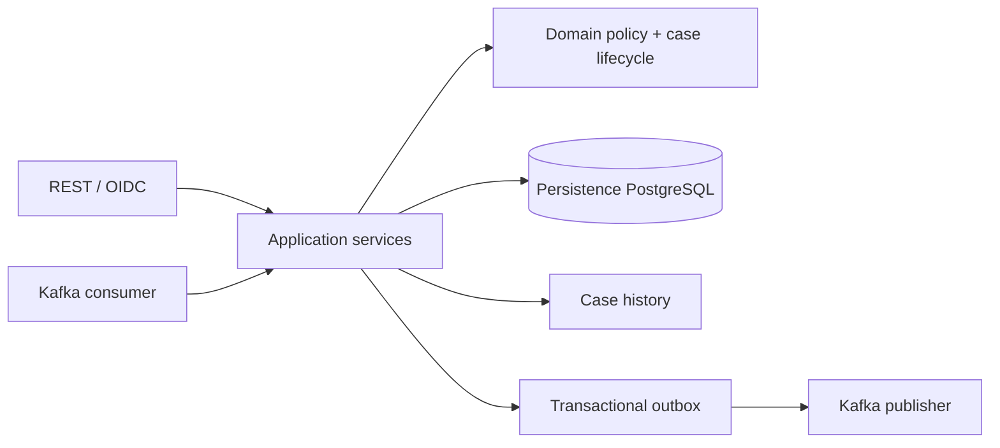
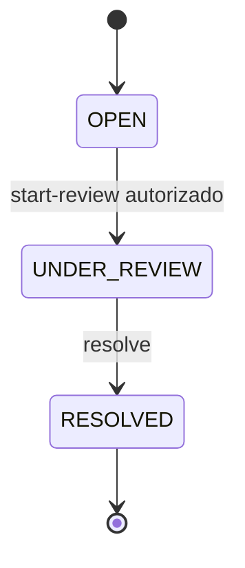

# Backend: señales automáticas e investigación humana

## Dos decisiones diferentes

FraudAssessment representa el resultado automático: PASS, REVIEW o BLOCK. FraudCase representa investigación humana: OPEN, UNDER_REVIEW, RESOLVED y disposición CLEARED/CONFIRMED_FRAUD. Resolver un caso no cambia la decisión del assessment original.

La captura muestra REVIEW + caso CLEARED. Son datos compatibles: el motor detectó una señal, el analista investigó y emitió una disposición separada. LO consume esa disposición y conserva la autoridad sobre su solicitud.

## Arquitectura modular por capas

Cada capability organiza API, application, domain y persistencia. La política es determinista y separada de HTTP; los servicios administran transacciones, repositorios, reloj y métricas. No se describe este proyecto como una copia de la arquitectura hexagonal de LO.

## Política loan-origination-fraud 1.0.0

El historial se filtra por customerId, ventana inclusiva de 24 horas, exclusión de la evaluación actual y de fechas futuras. El intento actual cuenta para velocidad. Los UUIDs son referencias técnicas; no se requiere introducir nombre, dirección o credenciales en Kafka.

| Señal | Condición | Aporte |
|---|---|---:|
| HIGH_APPLICATION_VELOCITY | ≥3 intentos en 24 h | 35 |
| APPLICATION_AMOUNT_ESCALATION | Importe >50% sobre el intento previo reciente | 20 |
| MATERIAL_INCOME_CHANGE | Cambio absoluto de ingreso >50% | 20 |
| MATERIAL_DEBT_CHANGE | Cambio absoluto de deuda >50% | 15 |
| RAPID_RESUBMISSION_AFTER_BLOCK | BLOCK previo en ventana | 60 y hard block |
| EXTREME_VELOCITY_WITH_AMOUNT_ESCALATION | ≥6 intentos y escalada >50% | 60 y hard block |

El score se acota a 0–100: LOW <25, MEDIUM <60, HIGH ≥60. Sin hard block, score <25 es PASS y el resto REVIEW. HIGH no implica por sí mismo BLOCK. Las dos reglas de hard block determinan BLOCK. Sin señales se registra NO_MATERIAL_FRAUD_SIGNALS.

Un cambio desde cero a un valor positivo se trata explícitamente al comparar datos materiales. El score no es probabilidad de fraude y las señales no equivalen a una imputación legal.

## Evaluación idempotente y casos

AssessFraudService compara la entrada material al recibir de nuevo assessmentRequestId. Cambiar solamente correlation ID no crea una segunda evaluación; cambiar el contenido con la misma referencia conflictúa. Evaluación, caso requerido y outbox se guardan bajo los límites transaccionales del servicio.

PASS no abre caso. REVIEW y BLOCK abren uno, con unicidad por assessment. El historial registra CASE_OPENED con actor del sistema.

FraudCaseService bloquea el caso, valida la transición, registra actor/nota/timestamp y emite historial. Sólo un caso UNDER_REVIEW puede resolverse. La nota tiene límite de 1.000 caracteres. Resolución, historial y evento de disposición forman una operación consistente. Los constraints de V4 refuerzan la relación entre estado y resolución.

## Gate hacia Loan Origination

fraud.assessment.completed.v1 contiene el resultado automático. fraud.case.resolved.v1 contiene la disposición humana. CLEARED puede liberar el gate en LO; CONFIRMED_FRAUD no lo libera. Ninguno de estos eventos crea directamente oferta, préstamo o desembolso desde Fraud.

En el modo integrado, LO debe combinar crédito y fraude. PASS no aprueba crédito, del mismo modo que APPROVE en Credit Risk no elimina un caso fraudulento pendiente.

## API, autorización y trazabilidad

FRAUD_ANALYST y ADMIN acceden a evaluación/casos. No existe un rol AUDITOR independiente en esta API. GET lista o detalla; POST start-review y resolve son comandos de investigación. La consola no cambia un caso con un PATCH genérico de estado.

El historial conserva acciones append-only y el assessment no se recalcula para mostrar un caso resuelto. Correlation ID conecta mensajes; una acción humana posterior puede tener otra correlación, sin perder los vínculos de assessment/case/application.

## Kafka y PostgreSQL

El consumer valida eventType/eventVersion y correlación antes de mapear la entrada. Los retries y DLQ separan fallos de procesamiento de resultados de negocio. Outbox entrega at-least-once después de commit; idempotencia y constraints resuelven repeticiones.

La base propia usa migraciones V1–V4. V4 incluye unicidad del caso por assessment y constraints de estado/resolución. Hibernate valida; no se comparte la base LO.

## Lo mostrado y lo pendiente

Se capturaron 30 evaluaciones y siete casos históricos resueltos. BLOCK no tenía fixture persistido: la galería muestra el filtro vacío y documenta las reglas desde código/tests. No se fabricó una respuesta ni se resolvió otro caso para completar la documentación.

No hay ML, datos de dispositivo, bureau, investigación documental, KYC/AML completo ni fraude de pagos. El alcance es evaluación demostrativa de comportamiento de solicitudes y workflow humano auditable.
