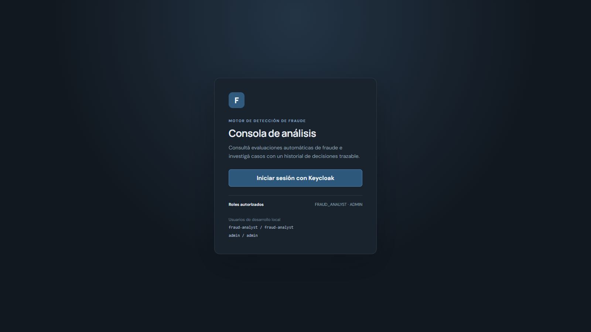
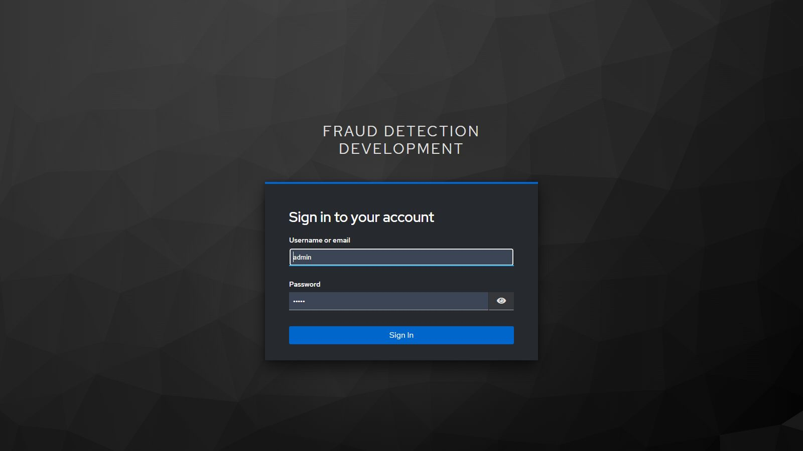
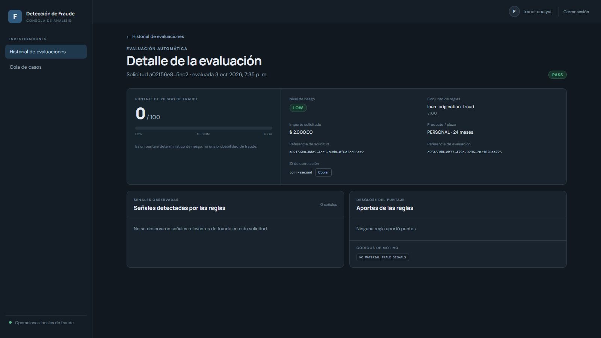
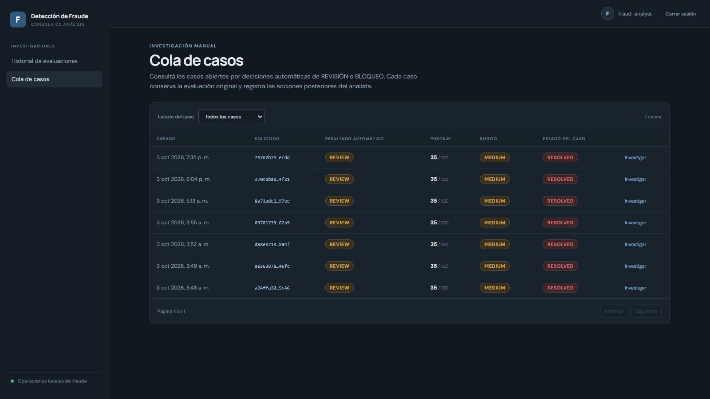
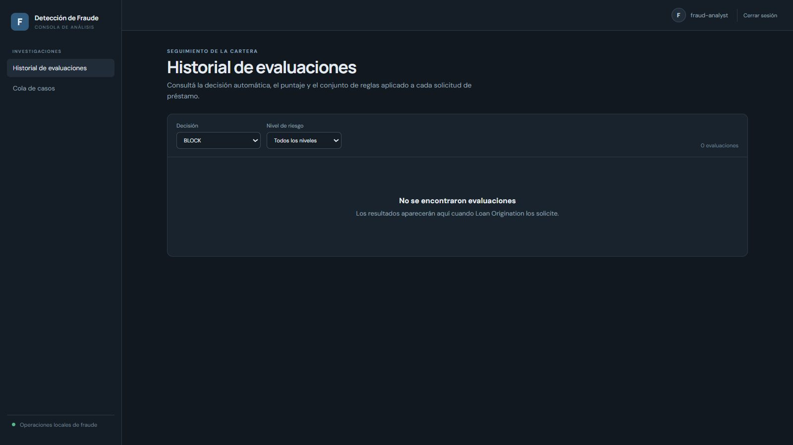
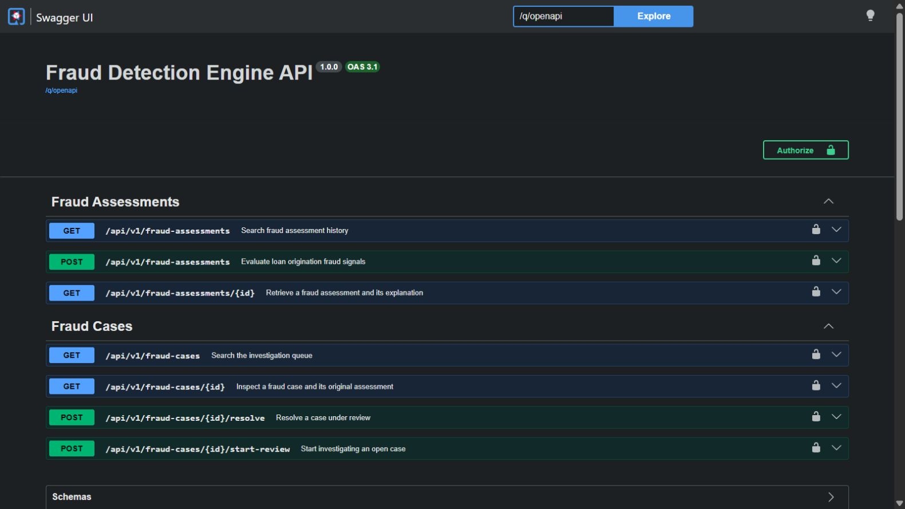
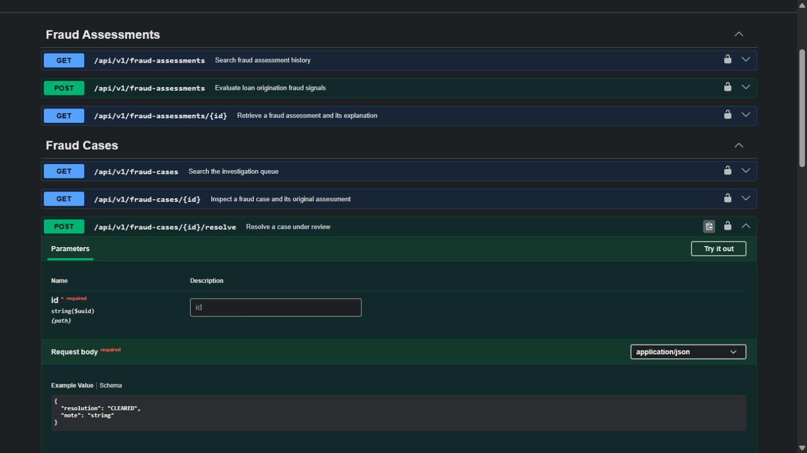

# Recorrido visual de Fraud Detection Engine

[Índice](README.md) · [Backend](backend-walkthrough.md) · [Evidencia](evidence-2026-10-10.md)

Capturas reales del 10/10/2026. Cada pantalla está conectada a la API y PostgreSQL locales. Los registros eran preexistentes; los formularios y acciones de operación se muestran sin ejecutarlos. Las vistas de autenticación no contienen contraseñas ni tokens.

## 1. Historial de decisiones automáticas

**Rol:** FRAUD_ANALYST · **Ruta:** /assessments

30 evaluaciones existentes. PASS y REVIEW pertenecen al assessment; no son resoluciones humanas.

## 2. Acceso de investigación

**Rol:** PUBLIC · **Ruta:** /login

Pantalla real del frontend y usuarios de demostración públicos.

## 3. Identidad del analista

**Rol:** PUBLIC · **Ruta:** /realms/fraud-detection/protocol/openid-connect/auth

Realm separado y formulario de autenticación vacío.

## 4. Sin señales relevantes: PASS

**Rol:** FRAUD_ANALYST · **Ruta:** /assessments/c95453d8-eb77-479d-9296-2021828ea725

Score 0/100, nivel LOW y NO_MATERIAL_FRAUD_SIGNALS. El importe de este fixture no implica elegibilidad en Credit Risk.

## 5. Velocidad de solicitudes: REVIEW

**Rol:** FRAUD_ANALYST · **Ruta:** /assessments/3003c6aa-2937-48f3-9370-8c691d8c457a

Score 35/100, MEDIUM y HIGH_APPLICATION_VELOCITY: tres intentos en 24 horas requieren investigación.

## 6. Cola de casos

**Rol:** FRAUD_ANALYST · **Ruta:** /cases

Siete casos existentes, todos resueltos en esta base. El servicio conserva la separación assessment/case.

## 7. Resolución humana CLEARED

**Rol:** FRAUD_ANALYST · **Ruta:** /cases/857868bc-6b81-4257-8138-9c99d91554c6

Caso RESOLVED con CLEARED. La decisión automática original sigue siendo REVIEW: resolver no reescribe el assessment.

## 8. Historial de investigación

**Rol:** FRAUD_ANALYST · **Ruta:** /cases/857868bc-6b81-4257-8138-9c99d91554c6

CASE_OPENED, REVIEW_STARTED y CASE_RESOLVED con actor y timestamps. No se resolvió un nuevo caso durante la captura.

## 9. Filtro BLOCK sin resultados

**Rol:** FRAUD_ANALYST · **Ruta:** /assessments

Estado vacío real. No había un fixture BLOCK persistido; sus reglas se documentan mediante código y tests, sin inventar una captura.

## 10. API de fraude y casos

**Rol:** PUBLIC · **Ruta:** /q/swagger-ui

Contrato REST real del backend, no una API financiera ni una operación sobre Loan.

## 11. Contrato de resolución

**Rol:** PUBLIC · **Ruta:** /q/swagger-ui

POST resolve con CLEARED/CONFIRMED_FRAUD y nota. Ejemplos autogenerados de Swagger son plantillas; no prueban una transición ejecutada.

## Cómo interpretar esta galería

Los IDs visibles corresponden a fixtures de desarrollo. No se afirma que todas las pantallas pertenezcan a la misma solicitud ni que el flujo haya sido ejecutado de cero en esta sesión. Swagger muestra el contrato generado; sus ejemplos son plantillas. Para pruebas ejecutadas, consultar la evidencia.
